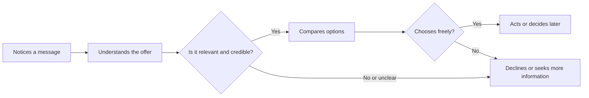

# Chapter 1: Persuasion and Human Decision-Making

Persuasion is part of ordinary life. A friend recommends a movie, a campus club invites new members, and a clothing brand explains why its product is worth choosing. In each case, someone is trying to shape another person's attention, interpretation, trust, or action.

## What Persuasion Means

In plain language, **persuasion is an attempt to help someone freely choose a belief, attitude, or action by giving them reasons, signals, or experiences that influence their decision**.

Persuasion does not guarantee a result. The person being persuaded keeps the ability to say yes, no, or not yet. Good persuasion makes a decision easier to understand; it does not hide the real decision.

For example, a seller can present a plain white T-shirt as a reliable everyday basic. A clear product description, an accurate size chart, and a photo showing the fit can help a shopper decide whether it meets their needs. The shopper is still free to leave without buying it.

## Persuasion, Manipulation, and Coercion

These ideas can look similar because all three can change behavior. The important difference is how they treat the other person's ability to make an informed, voluntary choice.

| Approach | What it does | Does the person retain meaningful choice? | Example |
| --- | --- | --- | --- |
| Persuasion | Gives relevant reasons and honest framing | Yes | Explaining that a white T-shirt is made from durable cotton and showing its care instructions |
| Manipulation | Uses hidden pressure, misleading information, or emotional tricks | Not fully | Claiming that a shirt is "almost sold out" when there is plenty of stock |
| Coercion | Uses threats, force, or serious penalties | No | Telling someone they will lose something important unless they buy |

Ethical persuasion is transparent about what is being offered, avoids false claims, and leaves room for refusal. Manipulation may produce a quick click or sale, but it damages trust when people discover the tactic. Coercion is more serious still: it replaces choice with pressure.

## Cialdini's Principles of Influence

Psychologist Robert Cialdini described several common patterns that can make a message more persuasive. These principles are not buttons that control people. They describe social shortcuts people often use when time, attention, or information is limited. Used honestly, they can help people notice useful information. Used carelessly, they can become manipulation.

- **Reciprocity:** People often want to return a helpful gesture. A store might offer a genuinely useful fabric-care guide before asking visitors to join its mailing list.
- **Commitment and consistency:** After people make a small voluntary commitment, they often prefer later actions that fit it. Someone who chooses a preferred shirt fit may be more willing to save that preference for future shopping.
- **Social proof:** People sometimes look to similar others when deciding what is sensible. Honest customer reviews can reduce uncertainty; fake reviews are deceptive.
- **Liking:** We are more open to people and brands we find relatable, respectful, or familiar. Friendly design and an understandable story can build connection, but should not distract from product facts.
- **Authority:** Relevant expertise can increase trust. A clothing company can explain its materials or testing process, but it should not pretend to have expertise it lacks.
- **Scarcity:** A genuinely limited item can feel more valuable or urgent. A notice that a particular white T-shirt color is being discontinued is appropriate only when it is true.
- **Unity:** People can be influenced by a shared identity or sense of belonging. A student organization might speak to fellow students as part of the same campus community without suggesting that membership proves someone is better than others.

## A Few More Useful Ideas

### Framing

**Framing** is the way information is presented. It changes which features people notice first, even when the underlying item stays the same. Framing should clarify a real benefit, as to not create a false impression.

Consider the same plain white T-shirt:

- For a student packing light, it can be framed as a versatile layer that works with several outfits.
- For someone who values simplicity, it can be framed as a clean, dependable staple.
- For a buyer concerned about care, it can be framed with accurate washing information and expected durability.

The shirt has not changed. The message has connected its real features to different needs.

### Cognitive Load and Choice Architecture

People have limited time and attention. **Cognitive load** is the mental effort required to understand information or make a decision. Too many choices, unclear labels, and hidden costs make decisions harder.

**Choice architecture** means arranging choices so people can understand them more easily. A respectful product page might put price, size options, material, delivery information, and returns policy where a shopper can find them before checkout. This helps the person decide; it should not use confusing defaults or buried cancellation steps to trap them.

### Ethos, Pathos, and Logos

Classical rhetoric offers another useful lens:

- **Ethos** is credibility. Accurate information and a consistent record of honesty support it.
- **Pathos** is emotional connection. A message can make a person feel confident, comfortable, or included.
- **Logos** is reasoning and evidence. Measurements, prices, comparisons, and clear explanations support it.

A responsible message usually combines all three. For the white T-shirt, a clear size chart supports logos, an honest description of the maker's expertise supports ethos, and an image of a comfortable everyday outfit may create pathos. None of these should contradict the actual product.

## Principles, Uses, and Risks

| Principle or idea | Mechanism | Ethical use | Misuse risk |
| --- | --- | --- | --- |
| Reciprocity | A helpful gesture can create a desire to respond | Offer useful information with no hidden obligation | Making a gift feel like a debt |
| Commitment and consistency | People prefer actions that match earlier choices | Let users save voluntary preferences | Turning a small choice into unwanted pressure |
| Social proof | People look to others when uncertain | Show genuine, relevant reviews | Using fake, purchased, or selective reviews |
| Authority | People rely on credible expertise | Name real qualifications and explain evidence | Borrowing prestige or inventing expertise |
| Scarcity | Limited availability can create urgency | State real deadlines or limited inventory | Creating false countdowns or artificial shortages |
| Unity | Shared identity can build trust and belonging | Speak respectfully to a real community | Implying that dissenters do not belong |
| Framing | Presentation directs attention to certain features | Match honest benefits to a user's needs | Hiding important tradeoffs or limits |
| Choice architecture | Layout and defaults affect the effort of deciding | Make key information and options easy to find | Using confusing defaults or difficult cancellation paths |

## A Simple Decision Journey

The diagram includes places where a person can pause, compare, decline, or seek more information. That freedom is part of ethical persuasion.

## Questions to Ask Before Trying to Persuade

- What decision am I asking someone to make?
- Does this message describe the product, cost, limits, and alternatives honestly?
- Who may be affected by this decision, especially people with less power or information?
- Am I making it easy to understand and refuse the offer?
- Would I be comfortable explaining this tactic openly to the audience?
- Does the message build trust over time, or only chase a short-term result?

## Explore Further

For research beyond this chapter, try searches such as:

- `Robert Cialdini principles of influence reciprocity social proof`
- `choice architecture behavioral economics ethical design`
- `ethos pathos logos rhetorical appeals examples`
- `dark patterns online design consumer choice`

Use course-library sources, peer-reviewed articles, and reputable books to check how different researchers define and study these concepts.

## What You Should Remember

Persuasion helps shape attention, interpretation, trust, and action, but it should preserve informed choice. Cialdini's influence principles, framing, cognitive load, choice architecture, and rhetorical appeals can make communication more effective. Their ethical use depends on honesty, relevance, transparency, and respect for a person's ability to say no. The plain white T-shirt is a useful reminder: a product can be framed for different audiences without changing the facts about what it is.
