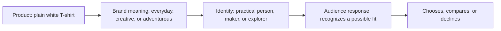

# Chapter 2: Brand Archetypes and Meaning

A product can do more than solve a practical problem. It can also suggest a story about who a buyer is, what they value, or what kind of life they imagine. Brand archetypes are a useful way to think about that added meaning.

The practical question is: **What does the audience get to feel, imagine, or become by choosing this brand?**

## What Are Brand Archetypes?

In branding, an **archetype** is a generalized cultural or narrative pattern that helps make a product, organization, or experience recognizable. An Explorer brand, for example, may emphasize independence and discovery. A Caregiver brand may emphasize support and protection.

Archetypes give a team a shared language for decisions. They can influence the words, images, colors, service style, product details, and stories a brand chooses. They do not replace evidence about the audience or the product itself. A clear return policy still matters more than a clever personality label.

Imagine a plain white T-shirt. Its material, cut, and color may stay exactly the same, but the meaning around it can change. It might be presented as a practical uniform for everyday life, a blank canvas for creative expression, or a simple companion for a new adventure. The archetype helps decide which meaning the brand emphasizes.

## Common Brand Archetypes

The following set is commonly used as a starting point. Each archetype represents a broad pattern, not a strict rule.

| Archetype | Core idea | What the audience may feel, imagine, or become | Example direction |
| --- | --- | --- | --- |
| Explorer | Freedom and discovery | Independent, curious, ready to go | A product for changing plans and open roads |
| Sage | Knowledge and understanding | Informed, thoughtful, capable | Clear explanations, evidence, and useful learning |
| Creator | Imagination and self-expression | Original, skilled, inventive | Tools or materials that invite making |
| Ruler | Order and control | Confident, respected, in command | Precision, quality standards, and dependable service |
| Caregiver | Support and protection | Looked after, responsible, connected | Comfort, accessibility, and helpful guidance |
| Rebel | Challenge and independence | Defiant, honest, unconstrained | Breaking an unhelpful rule or convention |
| Hero | Courage and achievement | Stronger, determined, capable of improvement | Meeting a difficult goal through effort |
| Everyperson | Belonging and practicality | Included, understood, at ease | Reliable solutions for ordinary life |
| Innocent | Simplicity and optimism | Hopeful, safe, refreshed | Clean design and straightforward promises |
| Jester | Play and enjoyment | Entertained, social, less serious | Humor, surprise, and a lively experience |
| Lover | Connection and appreciation | Desired, expressive, close to others | Sensory detail, beauty, and care |
| Magician | Transformation and possibility | Inspired, changed, able to imagine more | Turning an ordinary moment into something memorable |

## The Same White T-Shirt, Different Meanings

The shirt below is physically identical in every version: a plain white T-shirt. Only the position, language, setting, and supporting experience change.

### Everyperson: The Reliable Everyday Basic

This version treats the shirt as an uncomplicated part of real life. The message might emphasize an easy fit, straightforward care instructions, and how it works with clothes people already own. The audience gets to feel included and prepared without having to perform a special identity.

### Creator: The Blank Canvas

This version presents the shirt as material for self-expression. Its message might focus on a clean surface for printing, painting, or styling in individual ways. The audience gets to imagine becoming the person who makes something personal rather than buying a finished look.

### Explorer: Ready for the Next Stop

This version places the shirt in a light-packing or travel context. The message might emphasize versatility, comfort, and accurate care information for repeat use. The audience gets to imagine being adaptable and ready to leave routine behind.

### Ruler: The Deliberate Essential

This version uses restrained visual design and specific details about fit, construction, and consistency. Rather than claiming that the wearer is superior, it can appeal to people who want an orderly, considered wardrobe. The audience gets to feel composed and in control.

### Jester: A Serious Shirt With a Lighter Mood

This version uses playful photography, cheerful copy, or a surprising styling idea. The product facts remain easy to find. The audience gets to feel that an everyday choice can be fun instead of overly precious.

These versions should not make claims the product cannot support. A basic T-shirt cannot honestly promise adventure, creativity, or status on its own. It can, however, be connected to those meanings through a truthful story about how a person might use it.

## How Meaning Reaches an Audience

The path is not automatic. People bring their own experiences, needs, and cultural references to a message. A brand can offer meaning, but the audience decides whether that meaning feels relevant.

## Archetypes Are Not Destiny

Archetypes are models, not literal personality diagnoses. They cannot tell you who a person truly is, and they should not be used to stereotype audiences. A person may enjoy an Explorer-style trip, prefer an Everyperson-style wardrobe, and look for Caregiver-style service at different times.

Brands can also combine tendencies. A company may lead with the Sage's clear information while using the Caregiver's supportive tone. The goal is coherence, not purity. Combining too many conflicting signals can confuse people, but a thoughtful blend can reflect a fuller, more believable identity.

Cultural context matters as well. A symbol, color, joke, or story that suggests confidence in one community may carry a different meaning somewhere else. Before adopting an archetype, learn from the people the message is meant to serve. Testing language and visuals with a relevant audience is more useful than assuming one pattern works everywhere.

## Questions to Ask When Choosing an Archetype

- What real need, value, or experience does this product support?
- What does the audience get to feel, imagine, or become if the message succeeds?
- Which archetype best fits the product's actual strengths and the organization's behavior?
- Are we using a pattern to clarify meaning, or to stereotype people?
- Could a second archetype support the message without making it inconsistent?
- How might cultural context change the meaning of our words, images, or symbols?
- Does the positioning promise more than the product can honestly deliver?

## Putting the Framework to Work

Start with the product facts. For the white T-shirt, those might include fabric, fit, available sizes, care needs, and price. Next, identify a real audience situation, such as someone who wants easy everyday clothing or someone planning a screen-printing project. Then choose an archetype that highlights a truthful connection between the product and that situation.

Finally, check for consistency. A Creator position may use open-ended language and show personal customization. An Everyperson position may use plain language and show the shirt in ordinary routines. The experience after the purchase should match too: a brand that claims to be supportive should make help and returns understandable.

## What You Should Remember

Brand archetypes are flexible cultural and narrative patterns that help products carry recognizable meaning. They are not labels that diagnose people or rigid boxes that every brand must fit. By connecting a product's real strengths to what an audience wants to feel, imagine, or become, a brand can position the same plain white T-shirt as practical, creative, adventurous, or something else entirely. The strongest use of an archetype is honest, culturally aware, and consistent with the actual experience people receive.
