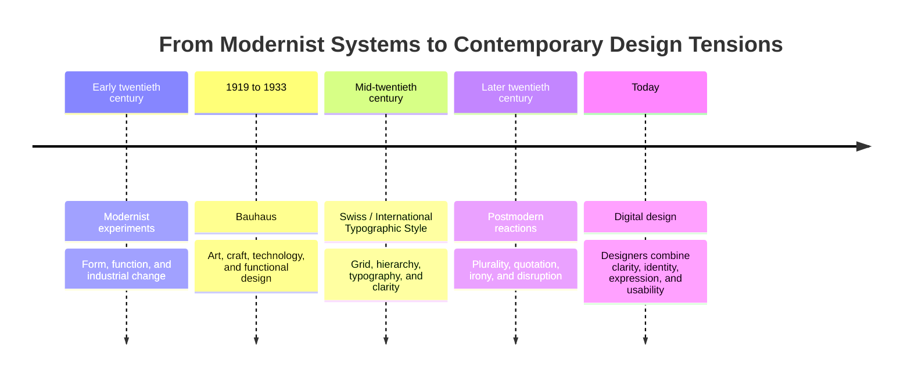

# Chapter 3: Modernism, Postmodernism, and Visual Language

Visual design is never only decoration. Type, spacing, color, images, and layout tell viewers what to notice and how to interpret what they see. A crisp grid can suggest order and competence. A crowded page with clashing type can suggest energy, rebellion, or overload. Learning some design history gives you words for reading those choices.

## A Short Path Into Modernism

Modernism developed across the early twentieth century, during a period of rapid industrial, social, and technological change. Many designers and artists asked how visual communication could suit a modern world. They often moved away from historical ornament and toward simpler forms, new materials, and systems that could be repeated.

This was not one single look or one group of people. It was a broad collection of movements and debates. Still, a common modernist ambition was to make design clearer, more functional, and more widely understandable.

### Bauhaus

The Bauhaus was a German school of art, design, and architecture active from 1919 to 1933. It is often associated with bringing art, craft, and industrial production into conversation. Teaching there explored how form, material, color, typography, and function could work together.

For a beginning designer, the useful lesson is not to copy a few geometric shapes. It is to ask how a visual choice serves a purpose. Does the type make the information readable? Does the form suit the material? Can a design be produced and used well?

### Swiss / International Typographic Style

In the mid-twentieth century, designers associated with the Swiss or International Typographic Style developed approaches that emphasized grids, asymmetric composition, sans-serif typography, photography, and clear visual hierarchy. The style sought an orderly structure that could make information easier to scan across languages and contexts.

Its influence still appears in posters, transit systems, editorial layouts, websites, and product interfaces. A clean navigation bar, consistent spacing, and a clear headline-to-body-text relationship are contemporary relatives of this interest in visual order.

## A Continuing Design Conversation

The timeline is a map of ideas, not a claim that one style completely replaced another. Earlier approaches remain active because different design problems call for different tools.

## Modernist Design Principles

Modernist design is often described through the following principles:

- **Grid:** An underlying structure aligns elements and creates rhythm.
- **Hierarchy:** Size, weight, position, and contrast show what matters first.
- **Clarity:** The viewer can quickly understand the main message and next action.
- **Reduction:** Remove elements that do not support the purpose.
- **Function:** Visual decisions should help the design work for its users and context.

These principles do not mean a design must be cold or empty. They are tools for organizing attention. A calm page can still have personality, and a simple product can still feel human.

## Postmodernism as a Reaction and Expansion

Postmodern design developed partly in response to the certainty, restraint, universality, and order often associated with modernism. Many postmodern designers questioned the idea that one clean visual system could speak equally well to everyone.

Postmodern work often welcomes **plurality, irony, disruption, quotation, and expressive typography**. It may mix references from different periods, make the grid visible or break it, and use visual abundance where modernism might use reduction. A quotation can be a direct visual reference to an earlier style, reused in a new context. Irony can make a design say, in effect, "we know this convention exists, and we are playing with it."

This does not make postmodernism careless. Breaking a rule communicates only when the audience can recognize the rule being challenged. A designer still needs to consider readability, access, audience, and purpose.

## Two Approaches in Comparison

| Design tension | Modernist tendency | Postmodern tendency | A contemporary digital example |
| --- | --- | --- | --- |
| Order and disruption | Stable layout and predictable alignment | Deliberate interruptions, overlap, or surprise | A dashboard uses a consistent grid; an event site interrupts it with animated type |
| Universality and identity | Aims for broad legibility and shared systems | Emphasizes local voices, subcultures, and multiple viewpoints | A public-service form uses neutral language; a community site uses a distinct regional voice |
| Clarity and expression | Information is easy to scan | Type and image can carry mood or argument | A banking app prioritizes clear labels; a music release page makes typography part of the experience |
| Grid and anti-grid | Elements follow a visible or invisible system | Elements may collide, shift, or resist alignment | A store uses repeated product cards; a portfolio uses irregular compositions |
| Restraint and abundance | Limited type, color, and decoration | Layering, pattern, references, and visual density | A settings screen minimizes choices; a campaign page combines image, stickers, and animated text |
| Function and irony | Form supports a practical task | Form may comment on conventions while still serving a task | A checkout flow stays direct; a playful game interface jokes about its own buttons |

The comparison is a guide, not a scorecard. Most current design mixes approaches depending on the situation. A medical appointment screen should favor clarity, while a festival poster or a creative portfolio may have more room for expressive risk.

## The Tension in Contemporary Digital Design

Modernism did not end when postmodernism appeared. The tension between them continues in web and product design.

An online banking screen, course-registration form, or map interface usually benefits from modernist tools: consistent navigation, clear labels, logical grouping, readable type, and obvious feedback after an action. In these situations, disruption can make a stressful task harder.

A fashion lookbook, music page, independent magazine, or artist portfolio may use postmodern tools: unexpected type scales, collage, visual references, animation, or a deliberately irregular layout. These choices can signal that the experience is expressive rather than purely efficient.

The important question is not "Which style is best?" It is "What does this visual language help the audience understand, feel, and do?" A good interface can be expressive without hiding essential information. A simple interface can be clear without becoming generic.

## One White T-Shirt, Two Visual Languages

The same plain white T-shirt can feel like different products through presentation alone.

### Modernist Presentation

A modernist product page might use a quiet background, a carefully cropped product image, a grid with generous spacing, and a small set of sans-serif type styles. The page would put price, fabric, fit, sizes, care instructions, and purchase controls in a clear hierarchy. The shirt feels like a precise, reliable essential because the presentation reduces distraction and makes comparison easy.

### Postmodern Presentation

A postmodern version might layer cutout images, handwritten-looking captions, oversized expressive type, visual references to several eras, and unexpected placements. It could present the shirt as an object to style, remix, or turn into a personal statement. The shirt itself has not changed, but the experience makes it feel more playful, culturally specific, or provocative.

Both versions still need truthful product information, readable text, and accessible controls. Visual language can add meaning; it should not conceal the facts a shopper needs.

## How to Read a Design

When you encounter a poster, page, app, package, or social post, pause before deciding whether you like it. Read it as a set of choices.

- What do you notice first, second, and third? This reveals the hierarchy.
- Is there a grid or repeated alignment system? If not, what replaces it?
- Which elements are restrained, and which are abundant or expressive?
- How does the typography affect the tone: neutral, serious, playful, urgent, luxurious, or something else?
- Does the visual language fit the task and audience?
- What information is made easy to find, and what information is hidden or delayed?
- Is the design borrowing from another period, place, or community? What might that reference communicate?

There is no need to force every design into either a modernist or postmodernist category. The value of the comparison is that it helps you describe what a design is doing and whether those choices serve people well.

## Museum Research

Museum and institutional collections can help you study authentic objects rather than relying only on reposts or image searches. Start with a collection's own website, find an object record, and verify its title, maker, date, medium, and collection information before using it in class work.

Try searches such as:

- `The Metropolitan Museum of Art modernist graphic design collection`
- `MoMA Bauhaus typography collection`
- `Cooper Hewitt International Typographic Style collection`
- `V&A postmodern graphic design collection`
- `Bauhaus archive typography poster collection`
- `museum collection Swiss graphic design grid`

You can also search a university library catalog for exhibition catalogs and books on Bauhaus, Swiss typography, modernism, and postmodern design. When taking notes, record where you found the object and distinguish a museum's description from your own interpretation.

## What You Should Remember

Modernist design developed ways of using grids, hierarchy, clarity, reduction, and function to organize communication. Bauhaus and the Swiss / International Typographic Style are important reference points in that history. Postmodern design questioned the idea that order and universality were always enough, making room for plurality, irony, disruption, quotation, and expressive typography. Contemporary digital design still moves between these approaches. The best choice depends on what a design needs to communicate and what its audience needs to do.
