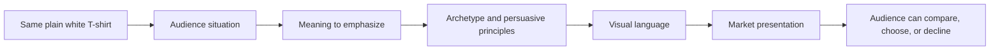

# Chapter 4: The Plain White T-Shirt Case Study

One ordinary high-quality plain white T-shirt sits at the center of this chapter. It has the same fabric, basic cut, color, care needs, and price range in every concept below. No secret redesign happens between versions.

What changes is the presentation: who the shirt is for, what it means, how it looks, and which reasons invite someone to notice it. That is why branding and design matter. They do not merely describe a product; they help people interpret it.

## The Shared Product

For this case study, assume the shirt is comfortable, well made, and plain white. It is not a luxury garment, performance equipment, or a miracle solution. Each concept must stay honest about that. The goal is to make the same product meaningful to different people without pretending it has become a different shirt.

## Concept 1: The Weekend Departure

**Target audience:** Students and young adults who like short trips, flexible plans, and packing light.

**Brand archetype:** Explorer.

**Persuasive principles:** Framing connects the shirt to freedom and versatility. Social proof can be used carefully through genuine customer travel photos. Clarity matters too: a shopper needs real information about care, fit, and repeat use.

**Visual language:** Airy photography, open space, natural light, a loose but orderly layout, and a small travel checklist. The design is practical rather than rugged or extreme.

**Headline:** `One shirt. More room to go.`

**Short product story:** This shirt is positioned as the piece you pull on after an early train, before a long walk, or when you have packed only one small bag. It does not turn the wearer into an adventurer. It supports a simple wish: to travel with less fuss.

**Likely imagery:** A folded white T-shirt beside a small bag, a map, and a water bottle; a person wearing the shirt in an ordinary outdoor setting; close-ups that show its real fit.

**Meaning the customer is invited to buy:** "I am flexible, curious, and ready for the next stop."

**Ethical risk or limitation:** The imagery could romanticize travel or imply performance the shirt cannot deliver. Do not use wilderness scenes to suggest weather protection, durability, or technical features the product does not have.

## Concept 2: The Daily Uniform

**Target audience:** People who want a dependable, uncomplicated wardrobe choice for work, school, or daily routines.

**Brand archetype:** Everyperson.

**Persuasive principles:** Commitment and consistency can support saved size or fit preferences chosen by the user. Authority comes from transparent product details, not vague claims of superiority. Choice architecture makes price, size, care, and returns easy to compare.

**Visual language:** Restrained modernist and Swiss-influenced design: a clear grid, generous white space, sans-serif type, a small color palette, and direct labels. Product facts appear before decorative storytelling.

**Headline:** `The easy answer to what to wear.`

**Short product story:** The shirt is presented as a reliable starting point for ordinary days. Its value is not exclusivity. It is the relief of having one simple option that works with clothes already in the closet.

**Likely imagery:** A front-and-back product view on a neutral background, a size guide, a small set of simple outfit combinations, and close-ups of fabric and construction.

**Meaning the customer is invited to buy:** "I can make everyday decisions simpler without giving up self-respect."

**Ethical risk or limitation:** "Essential" language can become empty if the shirt is not actually well made or the fit information is incomplete. The clean interface must not hide costs, shipping details, or a difficult return process.

## Concept 3: The Shirt That Starts a Conversation

**Target audience:** Creative students, makers, and people who enjoy customizing what they wear.

**Brand archetype:** Creator.

**Persuasive principles:** Reciprocity can take the form of genuinely useful printing, painting, or styling ideas. Liking grows from an inviting creative community. Framing emphasizes possibility rather than claiming that a shirt automatically makes someone artistic.

**Visual language:** Disruptive postmodern design: oversized expressive type, layered images, handwritten notes, deliberately off-grid composition, and bright accents around the neutral shirt. Important product details remain readable.

**Headline:** `Start plain. Make it yours.`

**Short product story:** Here, the white T-shirt is a beginning rather than a finished statement. The brand shows ways someone might print, draw on, layer, or style it, while making clear that the customer's own choices create the final result.

**Likely imagery:** A worktable with paint, fabric markers, and printed samples; cutout photos of different people styling the same shirt; process shots that show hands making rather than only polished final images.

**Meaning the customer is invited to buy:** "I can turn an ordinary object into something personal."

**Ethical risk or limitation:** The campaign must not present other artists' work as free decoration or assume every buyer has time, tools, or access to make custom clothing. It should also give accurate guidance about whether a technique works with the fabric.

## Concept 4: The Comfortable Constant

**Target audience:** People looking for comfortable basics and a considerate shopping experience, including buyers who value straightforward support.

**Brand archetype:** Caregiver.

**Persuasive principles:** Reciprocity appears as useful care guidance without hidden obligations. Social proof may use verified, relevant comments about fit or comfort. Empathy and clear choices lower cognitive load.

**Visual language:** Warm but uncluttered layouts, readable type, calm photography, plain-language guidance, and accessible contrast. The visual system is friendly without pretending to offer medical or therapeutic benefits.

**Headline:** `A comfortable place to begin.`

**Short product story:** The shirt is positioned as a small dependable comfort in a busy week. The experience emphasizes understandable sizing, helpful service, and no-pressure decisions. The product is still just a shirt, but the customer is treated as someone whose time and comfort matter.

**Likely imagery:** A person getting ready at home, close-up fabric photographs, a simple fit guide, and a service page that clearly explains support and returns.

**Meaning the customer is invited to buy:** "I deserve an everyday choice that feels considerate and easy."

**Ethical risk or limitation:** Comfort language can become manipulative if it exploits loneliness, anxiety, or body insecurity. The brand should not make health claims or use care as a reason to obscure ordinary product limitations.

## How the Elements Combine

The diagram shows a sequence of decisions, not a machine for controlling customers. The final presentation should still make the product's real details clear and preserve the audience's freedom to choose.

## Synthesis Table

| Concept | Audience and archetype | Persuasive approach | Visual language | Invited meaning | Main ethical limit |
| --- | --- | --- | --- | --- | --- |
| The Weekend Departure | Light-packing students and young adults; Explorer | Honest framing, genuine social proof, clear product facts | Airy travel imagery and practical open layout | I am ready to go | Do not imply technical outdoor performance |
| The Daily Uniform | People who want uncomplicated routines; Everyperson | Transparent details, voluntary preferences, easy comparison | Restrained modernist / Swiss grid and direct sans-serif labels | I can simplify an ordinary day | Do not hide costs or overstate quality |
| The Shirt That Starts a Conversation | Makers and creative students; Creator | Useful creative guidance, community, possibility framing | Disruptive postmodern collage, expressive type, and anti-grid energy | I can make this personal | Do not exploit artists or promise effortless creativity |
| The Comfortable Constant | Buyers seeking an easy, considerate experience; Caregiver | Helpful guidance, verified fit feedback, low cognitive load | Warm, calm, accessible and uncluttered | My comfort and time matter | Do not exploit vulnerability or make health claims |

## What This Case Study Shows

The four concepts are not four different products. They are four answers to different audience situations. The Explorer version foregrounds flexibility. The Everyperson version foregrounds dependable routine. The Creator version foregrounds expression. The Caregiver version foregrounds consideration and ease.

The strongest concept is not the loudest one. It is the one whose audience, meaning, persuasive choices, visual language, and real product facts agree with each other. When those pieces conflict, people notice. A playful page with hidden fees, or a calm care-focused message with unhelpful service, breaks trust.

## What You Should Remember

The same plain white T-shirt can feel radically different through branding and design, even though its physical qualities stay the same. A responsible market presentation connects a real audience need to an honest meaning, appropriate persuasive principles, and a visual language that supports the message. Good positioning makes a product easier to understand and choose. It does not use a good story to hide a weak or misleading offer.
