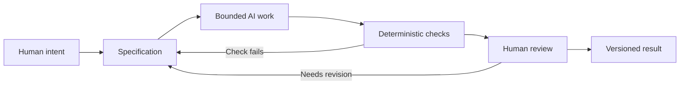

# Chapter 5: Directing AI With Meaning and Judgment

The earlier chapters introduced three ways to think about a message or product: persuasion, archetypes, and visual language. Together, they form a useful control framework for creative and technical work with AI.

AI can produce words, layouts, code, images, and variations quickly. Speed is useful, but speed does not decide what is worth making, whether a claim is true, or whether a result fits the people it affects. The human directing the work still needs a clear intention and a way to review the result.

## Three Lenses for Directing Work

The three lenses answer different questions:

| Lens | Guiding question | How it can direct AI-assisted work |
| --- | --- | --- |
| Persuasion | What response are we trying to enable? | Define the audience, their decision, and the honest information they need before asking AI for copy, a screen, or a feature |
| Archetype | What meaning or identity are we expressing? | Set a consistent tone, values, and relationship with the audience rather than asking for a vague "good brand" |
| Design language | How should that meaning look and feel? | Specify layout, typography, hierarchy, density, imagery, and interaction patterns that make the intended meaning visible |

For example, a prompt for an AI-designed product page could be more useful when it says: "Help a student compare a plain white T-shirt with confidence; use an Everyperson voice; use a restrained grid, clear hierarchy, and direct labels." That instruction gives the AI a purpose, a meaning, and a visual direction. It is much clearer than "make a cool shirt page."

## Start With a Specification

A **specification** is a clear description of what should be made, what must be included, what must not change, and how success will be checked. It gives an AI task boundaries.

Specifications do not need to be long. For a small task, they might state:

- the output file or feature to create;
- the target audience and goal;
- required content, behaviors, or constraints;
- examples of the desired tone or visual language;
- what should remain unchanged;
- checks that must pass before the work is accepted.

Boundaries prevent an AI from solving a different problem than the one you actually have. They also make review easier because you can compare the result against stated requirements rather than a vague feeling that it is "probably fine."

## Checks, Review, and Judgment

Different kinds of review answer different questions.

### Deterministic Checks

A **deterministic check** produces the same answer when given the same input. Examples include a test that passes or fails, a linter that reports a syntax problem, or a check that confirms a required Markdown heading exists.

These checks are cheap and repeatable. They are especially useful for catching mechanical problems early: a missing file, broken link, invalid format, failed test, or required field that was forgotten. They cannot tell you whether a page is kind, persuasive, culturally appropriate, or genuinely useful, but they can remove many avoidable mistakes.

### Probabilistic AI Review

An AI can also review a draft. It may notice unclear wording, missing acceptance criteria, uneven tone, or possible edge cases. This is useful, but it is **probabilistic**: the same kind of review may notice different things on different runs, and a confident comment can still be wrong.

Treat AI review as an additional perspective, not as proof. Ask it specific questions, such as "Which requirements from this specification appear missing?" Then check its answer against the actual work.

### Human Judgment

Humans remain responsible for judgment, meaning, truthfulness, context, and final decisions. A human needs to decide whether the work respects the audience, whether product claims are supported, whether a design is accessible, and whether the result matches the real purpose of the project.

Human review is a little like a race-car pit stop. The car and crew are built for motion, and automation can keep many systems running. But selected moments deserve a deliberate stop: someone inspects what matters, notices a loose part, and decides whether it is safe to continue. In AI-assisted work, do not wait for an accident to review the result. Plan meaningful inspection points before publishing, merging, or submitting.

## Version Control Gives the Work a Memory

Version control, such as Git, records changes over time. This matters when AI is generating work because AI can create many edits quickly, including edits you did not intend to keep.

Git helps you:

- see which files changed and compare an edit with its earlier version;
- connect a change to a purpose through a clear commit message;
- recover an earlier working version when a new attempt introduces a problem;
- review AI-generated changes in manageable pieces before accepting them;
- work with classmates or teammates without losing track of contributions.

Version control is not a substitute for thinking. It is a safety net and a record. Before committing, read the diff. A clean test run does not prove that a change says the right thing or belongs in the project.

## The Complete Workflow

The arrows back to the specification are important. A failed check may reveal a missing requirement. A human reviewer may realize that the goal, audience, or ethical boundary needs to be clearer. Revising the instruction is part of the work, not a sign of failure.

## A Practical Example

Suppose you want AI help drafting a landing page for the plain white T-shirt from Chapter 4.

1. **Human intent:** Help busy students understand a reliable everyday shirt and decide whether it fits their needs.
2. **Specification:** Create one page with an Everyperson tone, restrained modernist hierarchy, accurate product facts, a visible size guide, and no urgency claims.
3. **Bounded AI work:** Ask the AI to draft only the page copy or only the page component, not to redesign the whole project.
4. **Deterministic checks:** Confirm required headings, links, and tests are present and working.
5. **Human review:** Read the claims, check the price and care information, assess accessibility, and decide whether the page feels respectful and useful.
6. **Versioned result:** Review the changes and record the approved version in Git.

The AI saves time on drafting and iteration. The person directing it protects the purpose and takes responsibility for the finished result.

## Questions for Next Week

- Which parts of your next AI task can be stated as clear, testable requirements?
- What response do you want to enable for the audience, and what information do they need to decide freely?
- Which archetype or identity fits the project without becoming a stereotype?
- Which visual choices will support clarity, expression, or both?
- What automated checks can catch simple errors before a person spends time reviewing?
- Where will you schedule a deliberate human "pit stop" before the work is shared?
- What Git commit message would explain the purpose of your next approved change?

## What You Should Remember

Persuasion, archetypes, and design language help you direct AI with a clearer purpose: what response to enable, what meaning to express, and how that meaning should look and feel. A bounded specification keeps the task focused. Deterministic checks catch repeatable mechanical problems, while AI review offers a useful but imperfect perspective. Human judgment remains essential for truthfulness, context, ethics, and final decisions. Git gives the work traceability and a path back when an experiment does not belong in the final result.
